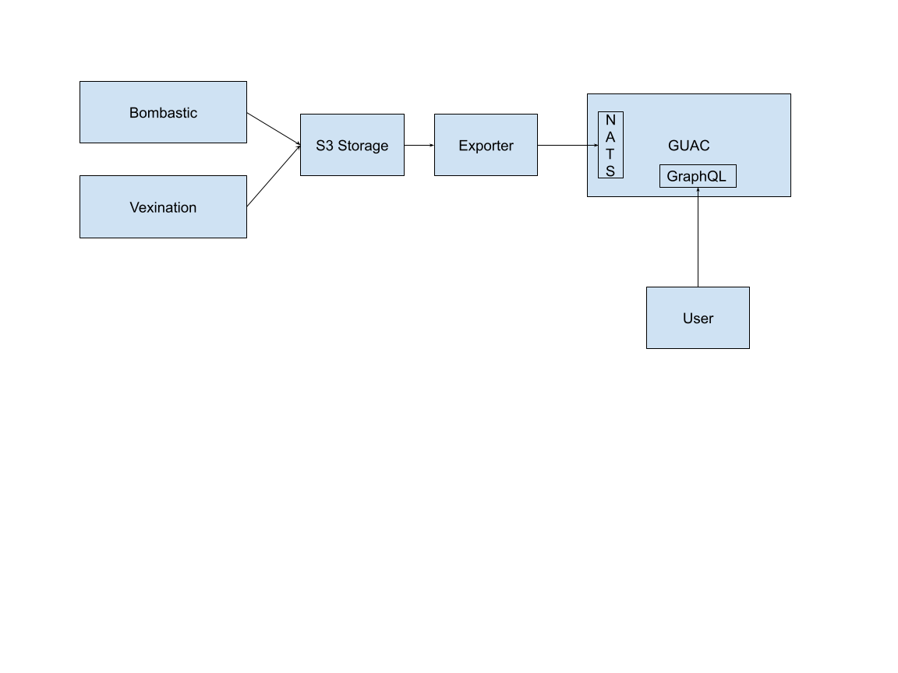

# S3 Guac Exporter

The exporter service gets notifications when SBOM or VEX documents get uploaded to S3 bucket and then ingest them into [Guac](https://guac.sh).

## Architecture

In general Exporter works in combination with Bombastic and Vexination (work in progress) APIs.



You can use those APIs to upload documents to S3 compatible storage. Exporter service subscribes to the notification events from the S3 service, download the document and send it to the event bus service (Nats at this moment) of Guac.

## Usage

Exporter can be ran with variety of different options for services. It can for example run with S3+SQS or Minio+Kafka combination of services.
The whole list of options is shown below.

```shell
Usage: trust exporter [OPTIONS]

Options:
      --guac-url <GUAC_URL>
          [default: 127.0.0.1:4222]
      --events <EVENTS>
          [default: kafka] [possible values: kafka, sqs]
      --stored-topic <STORED_TOPIC>
          [default: sbom-stored]
      --devmode

      --event-bus <EVENT_BUS>
          Event bus to configure [default: kafka] [possible values: kafka, sqs]
      --kafka-bootstrap-servers <KAFKA_BOOTSTRAP_SERVERS>
          Kafka bootstrap servers if using Kafka event bus [default: localhost:9092]
      --storage-bucket <BUCKET>
          Bucket name to use for storing data and index [env: BUCKET=]
      --storage-region <REGION>
          Storage region to use [env: REGION=]
      --storage-endpoint <ENDPOINT>
          Storage endpoint to use [env: ENDPOINT=]
      --storage-access-key <ACCESS_KEY>
          Access key for using storage [env: ACCESS_KEY=]
      --storage-secret-key <SECRET_KEY>
          Secret key for using storage [env: SECRET_KEY=]
  -h, --help
          Print help
```

If you wish to run it locally with Minio+Kafka combination, take look at [Developer guide](../DEVELOPING.md) for how to start them.

### Examples

Run against locally ran Minio and Kafka using default values

```shell
RUST_LOG=debug cargo run -p trust -- exporter  --devmode --storage-bucket bombastic
```

Run against Minio and Kafka using custom service host names

```shell
trust exporter --devmode --storage-endpoint http://minio:9000 --kafka-bootstrap-servers kafka:9094 --guac-url nats:4222
```

Run against aws services

```shell
export ACCESS_KEY=...
export SECRET_KEY=...
trust exporter --event-bus sqs --stored-topic sbom-stored --storage-bucket bombastic --guac-url trustification-nats:4222
```
